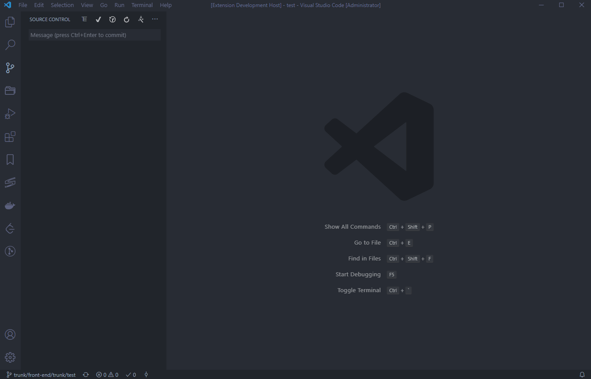

# svn-commit


基于 [Angular 提交规范](https://github.com/angular/angular/blob/22b96b9/CONTRIBUTING.md#-commit-message-guidelines)，方便快捷指定提交类型，生成规范的提交信息。

```
<type>(<scope>): <subject>
<BLANK LINE>
<body>
<BLANK LINE>
<footer>
```

## Features

* 自定义配置提交类型
* 支持同一个工作区多个 SVN 版本库
* 输入完成后自动提交

## Requirements

依赖于 [SVN](https://github.com/JohnstonCode/svn-scm) 插件，需提前安装该插件

## Extension Settings

```json
{
    // 是否在输入完成后自动提交
    "svn-commit.commit.autoCommitAfterInput": true,

    // 是否显示body的内容输入框
    "svn-commit.commit.showBodyInputBox": false,

    // 是否显示footer的内容输入框
    "svn-commit.commit.showFooterInputBox": false,

    // 是否显示scope的内容输入框
    "svn-commit.commit.showScopeInputBox": false,

    // subject 输入的最少字符数
    "svn-commit.commit.minSubjectSize": 5,

    // 可配置的提交类型
    "svn-commit.commit.types": [
        {
            "label": "feat",
            "detail": "新的功能特性"
        },
        {
            "label": "fix",
            "detail": "bug 修复"
        },
        {
            "label": "docs",
            "detail": "文档内容修改，新增"
        },
        {
            "label": "style",
            "detail": "代码格式，风格的改动"
        },
        {
            "label": "refactor",
            "detail": "代码重构"
        },
        {
            "label": "test",
            "detail": "测试相关"
        },
        {
            "label": "chore",
            "detail": "其他相关改动"
        }
    ]
}
```

## Known Issues

* 如果工作空间有2个svn版本库目录，则在手动移除一个工作空间时，可能会存在输入完成后未自动填充到输入框

**Enjoy!**
